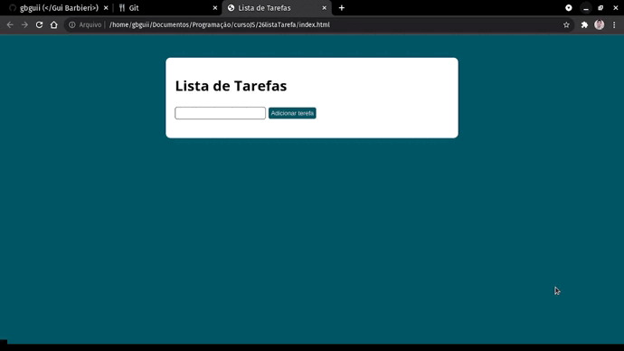

# Lista-Tarefa
### 
###  Projeto em JavaScript.
#
# Funcionalidades
### Lista de tarefas, podendo ser adicionado e excluido.
### Os dados ficam salvados no localstorage.
### Criação de elementos e classes através do JavaScript

